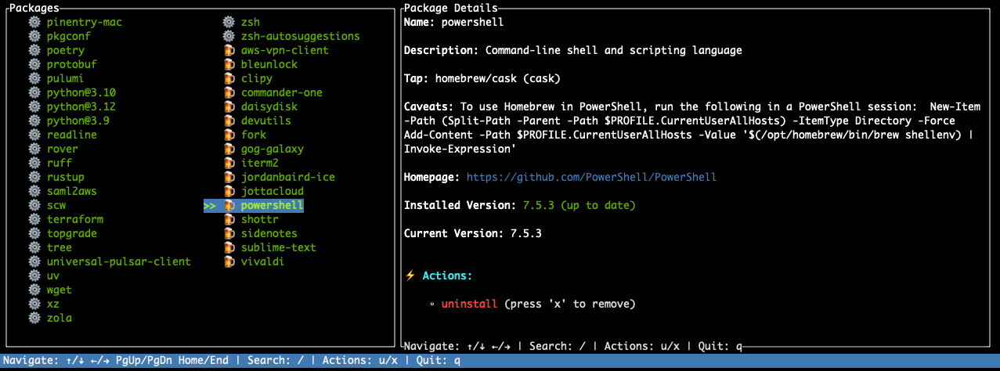
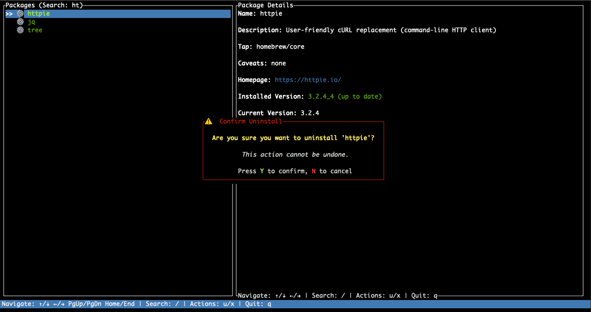

[](https://ratatui.rs/)

# 🍺 Brew Explorer

A beautiful terminal UI for exploring and managing your Homebrew packages with ease.

## What is Brew Explorer?

You know how after some time you run `brew list` and see a bunch of packages you have no idea about? Me too! It's frustrating to figure out what those packages do without copy/pasting their names into [brew.sh](https://brew.sh) and only then discovering what they're good for.  

That's why I created **Brew Explorer** - a little app that makes it easy to understand what formulaes and casks you have installed on your system.   
Plus, you can quickly **uninstall old useless things** and **update whatever was left behind** - all from within the same interface!

## Screenshots

### Loading Screen


### Main Screen



### Search and Uninstall



## Features

✨ **Appealing TUI** - Clean, intuitive terminal interface with ASCII art  
🔍 **Search functionality** - Quickly find packages by name  
📦 **Package details** - View descriptions, homepages, versions, and more  
🔄 **Update packages** - Update outdated packages with a single keystroke  
🗑️ **Uninstall packages** - Remove packages you no longer need  
🎨 **Color-coded status** - Green for up-to-date, red for outdated packages  
⚡ **Fast navigation** - Multi-column layout for efficient browsing  
🚀 **Auto-sync** - Runs `brew update` on startup for fresh package information

## Installation

### Prerequisites

- macOS (Homebrew is macOS-specific)
- [Homebrew](https://brew.sh) installed

### Steps

```shell
brew tap cosmincatalin/tap
brew install brew-explorer
```

### Navigation

- **↑/↓** - Move up/down in the package list
- **←/→** - Move left/right between columns
- **PgUp/PgDn** - Jump by pages
- **Home/End** - Jump to first/last package

### Actions

- **/** - Start searching for packages
- **u** - Update the selected package
- **x** - Uninstall the selected package
- **q** - Quit the application

### Search Mode

- Type any character to search for packages by name
- **Enter** or **Esc** - Exit search and return to browsing
- Navigation keys (↑/↓/←/→) still work while searching
